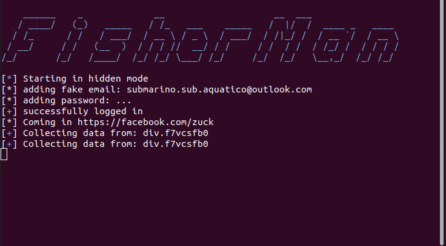

# FisherMan
[](https://github.com/Godofcoffe/FisherMan/blob/main/LICENSE)


### Search for public profile information on Facebook



## Installation
```
# clone the repo
$ git clone https://github.com/Godofcoffe/FisherMan.git

# change the working directory to FisherMan
$ cd FisherMan

# install the requirements
$ python3 -m pip install -r requirements.txt
```
## Pre-requisites
* Make sure you have the executable "geckodriver" installed on your machine.

## Usage
```
$ python3 fisherman.py --help
usage: fisherman.py [-h] [--version] [-u USERSNAMES [USERSNAMES ...]] [-sf]
                    [--specify {0,1,2,3,4,5} [{0,1,2,3,4,5} ...]] [-s] [-b]
                    [--email EMAIL] [--password PASSWORD] [--use-txt TXT_FILE]
                    [-o] [-c] [-v]

FisherMan: Extract information from facebook profiles. (Version 3.1.0)

optional arguments:
  -h, --help            show this help message and exit
  --version             Shows the current version of the program.
  -u USERSNAMES [USERSNAMES ...], --username USERSNAMES [USERSNAMES ...]
                        Defines one or more users for the search.
  -sf, --scrape-family  If this parameter is passed, the information from
                        family members will be scraped if available.
  --specify {0,1,2,3,4,5} [{0,1,2,3,4,5} ...]
                        Use the index number to return a specific part of the
                        page. about: 0, about_contact_and_basic_info: 1,
                        about_family_and_relationships: 2, about_details: 3,
                        about_work_and_education: 4, about_places: 5.
  -s, --several         Returns extra data like profile picture and number of
                        followers.
  -b, --browser         Opens the browser/bot.
  --email EMAIL         If the profile is blocked, you can define your
                        account, however you have the search user in your
                        friends list.
  --password PASSWORD   Set the password for your facebook account, this
                        parameter has to be used with --email.
  --use-txt TXT_FILE    Replaces the USERSNAMES parameter with a user list in
                        a txt.
  -o, --file-output     Save the output data to a .txt file.
  -c, --compact         Compress all .txt files. Use together with -o.
  -v, -d, --verbose, --debug
                        It shows in detail the data search process.
```
To search for a user
```
python3 fisherman.py -u name name.profile name.profile2
```

The username must be found on the facebook profile link, such as:
```
https://facebook.com/name.profile/
```

It is also possible to load multiple usernames from a .txt file, this can be useful for a brute force output type:
```
python3 fisherman.py --use-txt filename.txt
```

Some profiles are limited to displaying your information for any account, so you can use your account to extract.
Note: this should be used as the last hypothesis, and the target profile must be on your friends list:
```
python3 fisherman.py --email youremail@email.com --password yourpass
```

### Some situations:
* For complete massive scrape:
  ```
  python3 fisherman.py --use-txt file -o -c -sf
  ```
  With a file with dozens of names on each line, you can make a complete "scan" taking your information and even your family members and will be compressed into a .zip at the output.

* For specific parts of the account:
  *  Basic data: `python3 fisherman.py -u name --specify 0`
  * Family and relationship: `python3 -u name --specify 2`
  * It is still possible to mix: `python3 fisherman.py -u name --specify 0 2`

## *This tool only extracts information that is public, not use for private or illegal purposes.*

## LICENSE
BSD 3-Clause © FisherMan Project

Original Creator - [Godofcoffe](https://github.com/Godofcoffe)
